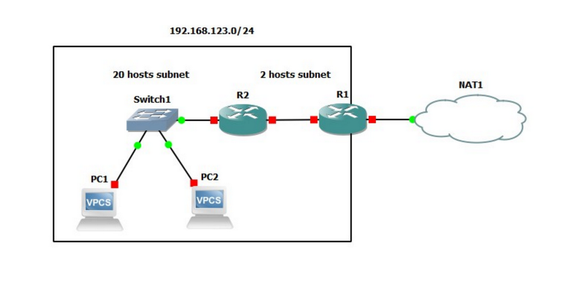

# KIV/PSI - 4. úloha - Nastavení NAT sítě

## Zadání 
Proveďte nastavení „malé domácí“ sítě připojené do Internetu přes dva směrovače a NAT podle uvedeného schématu v simulátoru GNS3. Použijte uvedený adresní prostor, který rozdělíte na dvě podsítě podle doporučení ve schématu.



## Nastavení routeru R1
Nastavení rozhraní R1 - NAT (G 0/0)
```
interface gigabitEthernet 0/0
ip address dhcp
ip nat outside
no shutdown
exit
```

Nastavení rozhraní R2 - R1 (G 1/0)
```
interface gigabitEthernet 1/0
ip address 192.168.123.253 255.255.255.252
ip nat inside
no shutdown
exit
```

Nastavení směrování do sítě
```
ip route 192.168.123.0 255.255.255.0 gigabitEthernet 1/0
```

Konfigurace NAT
```
access-list 1 permit 192.168.123.0 0.0.0.255
ip nat inside source list 1 interface gigabitEthernet 0/0 overload
```

## Nastavení routeru R2

Nastavení rozhraní R2 <-> R1 (G 0/0)
```
interface gigabitEthernet 0/0
ip address 192.168.123.254 255.255.255.252
no shutdown
exit
```

Nastavení rozhraní Switch1 <-> R2
```
interface gigabitEthernet 1/0
ip address 192.168.123.1 255.255.255.224
no shutdown
exit
```

Nastavení směrování (default gateway)
```
ip route 0.0.0.0 0.0.0.0 192.168.123.253
```


Nastavení DHCP
```
ip dhcp excluded-address 192.168.123.1
ip dhcp pool LAN
network 192.168.123.0 255.255.255.224
default-router 192.168.123.1
dns-server 1.1.1.1
exit
```

#### Ping - připojení k internetu lze otestovat pingem libovolného veřejného serveru, např.:
```
ping seznam.cz
```
